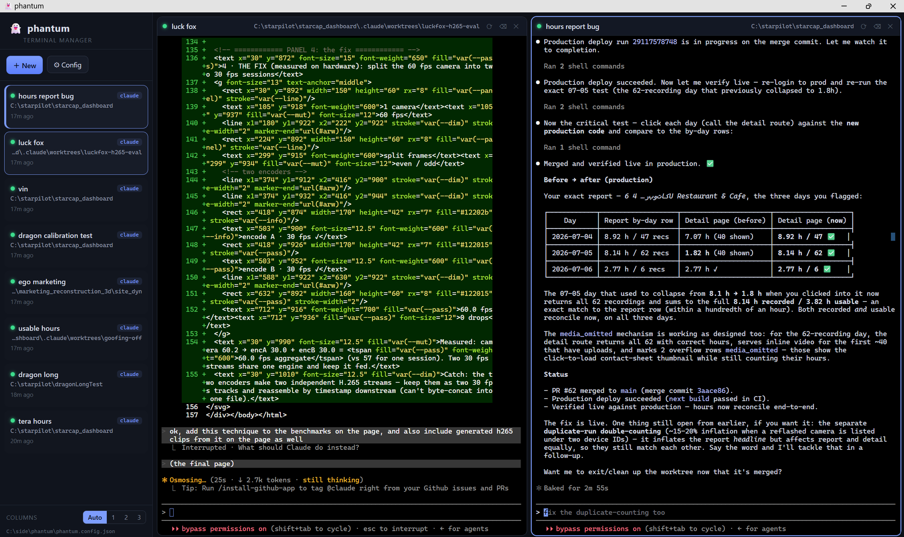

# 👻 phantum

**A dashboard for managing all your Claude Code terminals on one screen.**

[](https://github.com/ultrafro/phantum/stargazers)
[](./LICENSE)
[](#)



phantum runs a small local server on your PC and gives you a browser-based
control panel: a list of your terminals ("chats") on the left, and as many live
terminal panes as you want tiled on the right. Click a chat to open it as a
pane; click again to tuck it away. Your layout and every terminal's settings are
**saved automatically**, so the whole cockpit comes right back up after a
restart.

Each pane is a **real Windows terminal** (ConPTY via `node-pty`), so everything
Claude Code needs works — colors, interactive prompts, resizing, and
**clipboard image paste** (see [below](#does-image-paste-ctrl--v-work)).

> Built for Windows, but the server runs anywhere Node does.

---

## Features

- **Sidebar of chats** — name, working directory, launch command, live
  running/stopped status, and "last accessed" for each.
- **Open many panes at once** — click chats to tile them; auto-layout or pick
  1/2/3 columns.
- **Real terminals** — full ConPTY fidelity; run `claude`, PowerShell, cmd,
  Git Bash, or any executable.
- **Per-chat commands & flags** — pick a shell and toggle common Claude flags
  like `--dangerously-skip-permissions`, `--continue`, `--model`, and
  `--resume <session-id>` (resume a specific past conversation), or add any
  extra arguments. Enter a `--resume` session id and phantum **auto-detects the
  project directory** that session belongs to and fills it in — otherwise
  `claude --resume` can't find it.
- **Rename in one gesture** — double-click a chat's name in the sidebar (or a
  pane's title) to rename it inline; Enter saves, Esc cancels.
- **Sessions survive reloads** — closing a pane keeps its process running on
  the server; reopen it to pick up right where you left off. (A full app
  restart starts fresh terminals — old processes don't outlive the server.)
- **Reopens to your last setup** — layout, open panes, columns, focus, and chat
  configs autosave to `phantum.config.json` continuously, with a localStorage
  backup and a flush-on-close, so after a computer restart phantum comes right
  back up exactly as you left it.
- **Save / share / load configs** — export your whole setup as JSON, hand it to
  a teammate, and load theirs.
- **Double-click to run** — no build step.

---

## Quick start

**Requirements:** [Node.js](https://nodejs.org) 18+ installed. (For the
`claude` command to work in a pane, the [Claude Code
CLI](https://docs.claude.com/en/docs/claude-code) must be on your PATH.)

### The easy way (Windows)

1. Download / clone this repo.
2. **Double-click `phantum.vbs`.**
   - First launch installs dependencies automatically (one time).
   - It then opens phantum in its own app window.
3. Click **＋ New** to create your first terminal.

To stop the background server, double-click **`stop-phantum.vbs`**.

### The manual way (any OS)

```bash
npm install
npm start
# then open http://127.0.0.1:59333
```

`phantum.bat` does the same thing but keeps the server log visible in a console
window.

### Desktop shortcut with an icon

To drop a nicely-iconed **phantum** shortcut on your desktop (handles OneDrive
desktop redirection automatically):

```powershell
powershell -ExecutionPolicy Bypass -File scripts\make-shortcut.ps1
```

That points a `phantum.lnk` at `phantum.vbs` and gives it `phantum.ico` (the
ghost mark). Re-generate the icon anytime with
`scripts\make-icon.ps1`. Add `-AllDesktops` to place it on both the OneDrive and
classic desktop folders.

---

## Using it

| Action | How |
| --- | --- |
| New terminal | **＋ New** — set name, folder, command, and flags |
| Open / close a pane | Click a chat in the sidebar |
| Rename a chat | **Double-click** its name (sidebar or pane header) |
| Edit a chat (dir/command/flags) | Hover the chat → ✎ |
| Restart a terminal | Hover the chat or pane → ⟳ |
| Delete a chat | Hover the chat → 🗑 |
| Change layout | **Columns** control at the bottom-left |
| Export config | **⚙ Config → Export JSON** |
| Save a snapshot | **⚙ Config → Save config as…** |
| Load a config | **⚙ Config → Load / import JSON** |

### Copy & paste in a pane

| Shortcut | Does |
| --- | --- |
| `Ctrl+C` | **Copies** the selection if there is one; otherwise sends SIGINT (interrupt) — just like Windows Terminal |
| `Ctrl+Shift+C` | Always copies the selection |
| `Ctrl+V` | **Pastes** — text goes into any shell; if the clipboard holds an image, Claude Code grabs it |
| Right-click | Copies the selection, or pastes if nothing is selected |

Paste uses the browser's native paste event, so it works in every pane
(PowerShell, cmd, Claude…) with no clipboard-permission prompt.

### Does image paste (Ctrl + V) work?

**Yes.** When you paste and the clipboard holds an image, phantum hands Claude
Code a raw `Ctrl+V`; Claude then reads the image straight from the OS clipboard
itself (it runs on the same machine) — it never has to travel over the wire.
Text pastes are delivered directly to the shell as a bracketed paste. Panes open
in an app-mode window (Edge/Chrome `--app`), which also reclaims most reserved
shortcuts.

---

## Configuration

Everything lives in **`phantum.config.json`** next to the app (override the
location with the `PHANTUM_CONFIG` env var). It's plain JSON — see
[`config.example.json`](./config.example.json). A chat looks like:

```json
{
  "id": "abc123",
  "name": "phantum",
  "cwd": "C:\\side\\phantum",
  "shell": "claude",
  "args": ["--dangerously-skip-permissions"],
  "lastAccessed": 1720000000000
}
```

`shell` accepts the shortcuts `claude`, `pwsh`, `powershell`, `cmd`, `bash`, or
any executable name/path. `args` is passed to it verbatim.

### Environment variables

| Var | Default | Purpose |
| --- | --- | --- |
| `PORT` / `PHANTUM_PORT` | `59333` | Server port |
| `PHANTUM_HOST` | `127.0.0.1` | Bind address |
| `PHANTUM_CONFIG` | `./phantum.config.json` | Config file path |

---

## How it works

```
 browser (xterm.js panes)  ──WebSocket──►  Node server  ──ConPTY──►  claude / shells
        ▲                                      │
        └──────────  REST /api/config  ◄────────┘   (autosaved to phantum.config.json)
```

- **`server.js`** — Express serves the UI and a REST API; a WebSocket per pane
  bridges keystrokes and output to a pty.
- **`lib/terminals.js`** — spawns and tracks one live pty per chat, buffering
  recent output so reconnecting panes replay the current screen.
- **`lib/store.js`** — loads/saves the config with debounced atomic writes.
- **`public/`** — the xterm.js front-end (no build step; served from
  `node_modules`).

---

## Security note

phantum binds to `127.0.0.1` only and is meant to run on your own machine. It
spawns real shells with the arguments you configure and can browse your
filesystem for the folder picker — don't expose the port to untrusted networks.

---

## License

MIT © ultrafro
